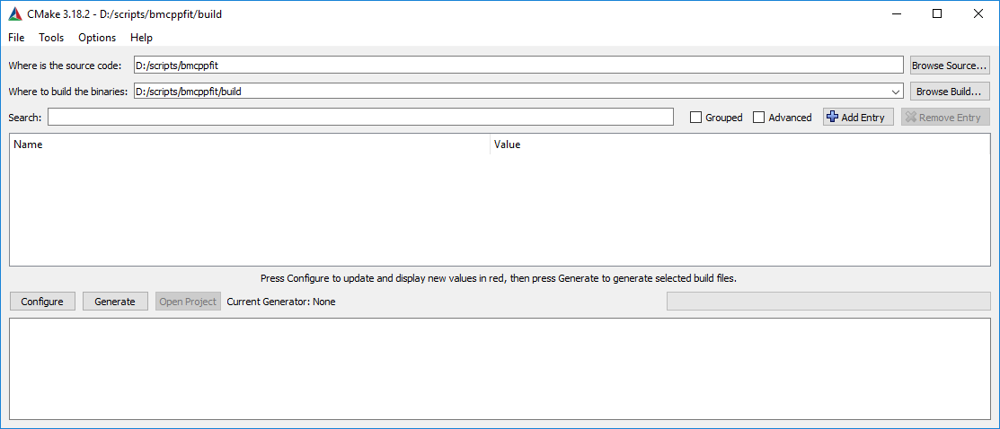
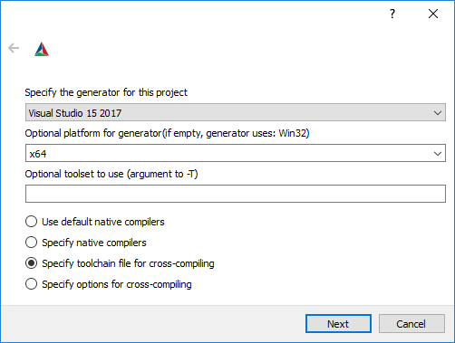
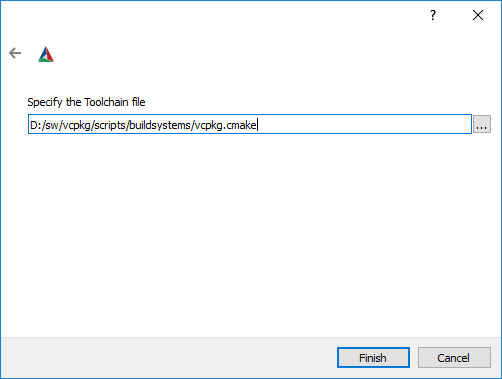
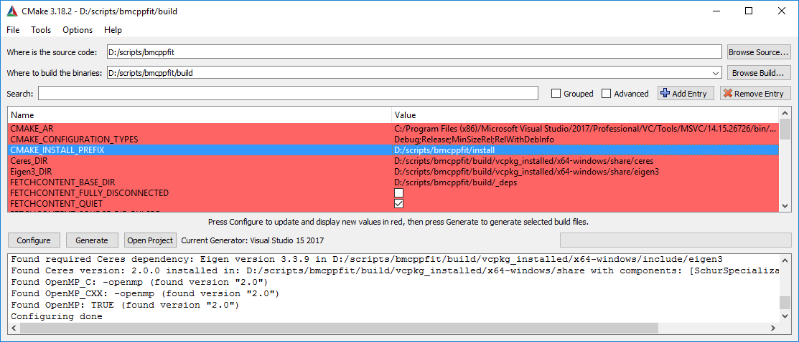

# About
*bmcppfit* is a (work-in-progress) standalone, multi-thread, Bloch-McConnell fit application. 
It was developed next to [Pulseq-CEST](https://github.com/kherz/pulseq-cest) and is compatible with the pulseq-cest simulation setting files. As the C++ simulation code is very similar, *bmcppfit* might be merged to the Pulseq-CEST project at some point.

*bmcppfit* can be called from the command line with a fit parameter yaml-file as input:
```
bmcppfit -p="parameter_file.yaml" -o="results.yaml"
```

A detailled description of the parameters etc can be found in the subfolder [Readme](doc/Readme.md)

# Install

You can either use [docker](#install-with-docker) or install it [locally](#install-locally)

# Install with docker

Follow these steps to build the docker image:
Clone the repository and go to the Docker folder:
```
git clone https://github.com/kherz/bmcppfit
cd bmcppfit/docker
```
Build the container (this will take a while)
```
sudo docker build -t bmcppfit:latest .
```
Enter the container with a mounted tmp folder
```
sudo docker run --rm --it -v /tmp:/tmp bmcppfit
```
You can now use the container and save intermediate data in /tmp. 
You can call the fit andrun the example with:
```
/opt/code/bmcppfit/install/bin/bmcppfit -p=/opt/code/bmcppfit/tests/matlab/yaml_fit.yaml -o=/tmp/fit_results.yml
```
The fit results are now in /tmp/fit_results.yml

# Install locally

This is tested on Windows (with Visual Studio 2017) and Ubuntu (with gcc 9.3.0):

## Prerequisites 

* A compiler with at least C++ 14 standard 
* [Git](https://git-scm.com/) 
* [CMake](https://cmake.org/) >= 3.16
* [vcpkg](https://github.com/microsoft/vcpkg) (If not installed, please follow the steps below. Otherwise continue [here](#build-bmcppfit))

## Install vcpkg
Clone the vcpkg repository
```
git clone https://github.com/microsoft/vcpkg
```
Then depending on your OS, run:
### Linux
```
./vcpkg/bootstrap-vcpkg.sh
```

### Windows
```
.\vcpkg\bootstrap-vcpkg.bat
```
For windows, the standard architechture is x86. It is recommended to change the default to x64 on 64 bit systems by setting the environment variable:

VCPKG_DEFAULT_TRIPLET=x64-windows

See vcpkg installation guide for more details.


## Build bmcppfit
Clone the repository:
```
git clone https://github.com/kherz/bmcppfit
```
and prepare build directories:
```
cd bmcppfit
mkdir build
cd build
```
Go on depending on your compiler:
### Linux with GCC 
```
cmake ../ -DCMAKE_INSTALL_PREFIX=../install -DCMAKE_TOOLCHAIN_FILE=${PATH_TO_VCPKG_INSTALLATION}/vcpkg/scripts/buildsystems/vcpkg.cmake -DCMAKE_BUILD_TYPE=Release
make
make install
```

### Windows with Visual Studio

You can either use the [command line](#using-the-cmake-command-line) or the [GUI](#using-the-cmake-gui)

#### Using the CMake command line
```
cmake ../ -DCMAKE_INSTALL_PREFIX=../install -DCMAKE_TOOLCHAIN_FILE=${PATH_TO_VCPKG_INSTALLATION}/vcpkg/scripts/buildsystems/vcpkg.cmake -DCMAKE_BUILD_TYPE=Release -DCMAKE_GENERATOR_PLATFORM=${Your Platform: This is x64 if you build for a x64 system}
```

* Open Visual Studio Solution bmcppfit.sln

#### Using the CMake GUI
* Open the CMake GUI and set the source and build directory accordingly



* Click configure and set the plattform and toolchain option accordingly.



* Choose the *vcpkg* toolchain file



The configuration process starts now and might take a while the first time since all external packages need to be downloaded and build.

* Once the configuration is done, set the install directory accordingly.



* Finally click *Generate* and *Open Project*

#### Build with visual Studio

* Change Cofiguration to Release
* Build **ALL_BUILD**
* Build **INSTALL**

### Done
The binaries are now in *bmcppfit/install/bin*

