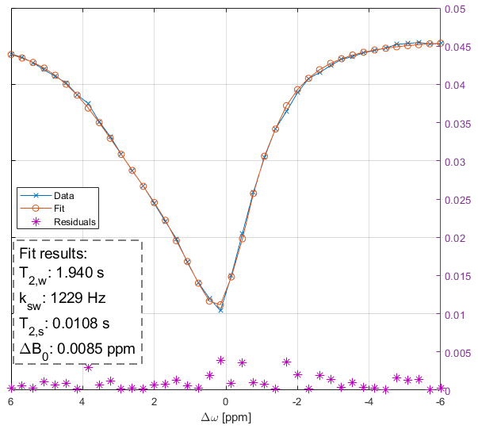

# About
*bmcppfit* is a (work-in-progress) flexible standalone, multi-thread, Bloch-McConnell fit application. 
It was developed next to [Pulseq-CEST](https://github.com/kherz/pulseq-cest) and is compatible with the pulseq-cest simulation setting files. As the C++ simulation code is very similar, *bmcppfit* might be merged to the Pulseq-CEST project at some point.

*bmcppfit* can be called from the command line with a fit parameter yaml-file as input:
```
bmcppfit -p="parameter_file.yaml" -o="results.yaml"
```

A detailled description of the parameters etc can be found in the subfolder [Readme](doc/Readme.md)



# Install

You can either download the latest pre-compiled binaries from the GitHub [workflow](https://github.com/kherz/bmcppfit/actions/workflows/build.yml) or [Releases](https://github.com/kherz/bmcppfit/releases), use [docker](#docker) or install it [locally](#install-locally).

# Docker

You can pull the latest image from [dockerhub](https://hub.docker.com/r/kherz/bmcppfit):
```
docker pull kherz/bmcppfit:latest
```
Afterwards, enter the container with a mounted tmp folder:
```
docker run --rm -it -v /tmp:/tmp kherz/bmcppfit
```
You can now use the container and save intermediate data in /tmp. 
You can run the example with:
```
/opt/code/bmcppfit/install/bin/bmcppfit -p=/opt/code/bmcppfit/tests/matlab/FP_GM_3T_001_bmcppfit.yaml -o=/tmp/fit_results.yml
```
The fit results are now in /tmp/fit_results.yml

# Install locally

## Prerequisites 

* A compiler with at least C++ 14 standard 
* [Git](https://git-scm.com/) 
* [CMake](https://cmake.org/) >= 3.16
* [vcpkg](https://github.com/microsoft/vcpkg) (If not installed, please follow the steps below. Otherwise continue [here](#build-bmcppfit))

## Install vcpkg
Clone the vcpkg repository
```
git clone https://github.com/microsoft/vcpkg
```
Then depending on your OS, run:
### Linux
```
./vcpkg/bootstrap-vcpkg.sh
```

### Windows
```
.\vcpkg\bootstrap-vcpkg.bat
```
For windows, the standard architechture is x86. It is recommended to change the default to x64 on 64 bit systems by setting the environment variable:

VCPKG_DEFAULT_TRIPLET=x64-windows

See vcpkg installation guide for more details.


## Build bmcppfit
Clone the repository:
```
git clone https://github.com/kherz/bmcppfit
```
and prepare build directories:
```
cd bmcppfit
mkdir build
```
Configure CMake (will take a while if vcpkg packages need to be built):
```
cmake -B build -DCMAKE_TOOLCHAIN_FILE=${PATH_TO_VCPKG_INSTALLATION}/vcpkg/scripts/buildsystems/vcpkg.cmake -DCMAKE_BUILD_TYPE=Release
```
Run the build process: 
```
cmake --build build --config Release
```
Run *install* to copy the binary and dependencies to the install directory
```
cmake --install build --prefix install
```
The binaries are now in *bmcppfit/install/bin*.

